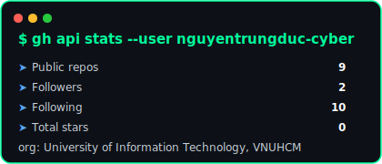
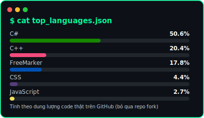

<div align="center">

```
root@ductech:~# whoami
```

# Nguyễn Trung Đức

### CyberSecurity Enthusiast · IT Student @ UIT (VNUHCM)


</div>

---

### `$` cat about_me.md

```yaml
name: Nguyễn Trung Đức
role: IT Student — University of Information Technology (UIT), VNU-HCM
mssv: 24520324
focus: Network Programming, System Administration, Cybersecurity, IAM
status: "Team Lead @ multiple group projects"
current_courses:
  - NT106 - Network Programming
  - NT132 - Network & System Administration
```

---

### `$` ls current_projects/

| Project | Mô tả | Stack |
| :--- | :--- | :--- |
| 🔐 [**keycloak-iam-project**](https://github.com/nguyentrungduc-cyber/keycloak-iam-project) | Hệ thống IAM (SSO, RBAC, MFA, SAML 2.0, Social Login) dùng Keycloak, HA + Load Balancer | `Keycloak` `Docker` `Nginx` `Node.js` |
| 💬 [**SecureChat**](https://github.com/nguyentrungduc-cyber/NT106-DoAn-Nhom06) | Ứng dụng chat kiểu Telegram — WinForms Client + ASP.NET Core Server, mã hóa AES | `C#` `WinForms` `ASP.NET Core` `MySQL` |
| 🎮️ [**Game đoán số**](https://github.com/nguyentrungduc-cyber/Multiplayer_Guess_Number) | Lập trình mạng căn bản - NT106.Q22.ANTT - Lab 06 tổng hợp | `C#` `WinForms` |
| 🌐 **web-het-tien-rui** | Dự án web nhỏ, thực hành front-end | `CSS` |
| 🧠 [**Object-Oriented-Programming_UIT**](https://github.com/nguyentrungduc-cyber/Object-Oriented-Programming_UIT) | Bài tập thực hành OOP | `C++` |
| 🗂️ [**Data-Structures-and-Algorithms-UIT**](https://github.com/nguyentrungduc-cyber/Wecode_DSA) | Bài thực hành Cấu trúc dữ liệu & Giải thuật | `C++` |

---

### `$` cat skills.json

```json
{
  "languages": ["C#", "C++", "JavaScript", "SQL"],
  "backend": ["ASP.NET Core", "Node.js", "Express"],
  "security_iam": ["Keycloak", "OIDC", "OAuth 2.0", "SAML 2.0", "JWT", "MFA/TOTP", "RBAC"],
  "infra": ["Docker", "Docker Compose", "Nginx", "Fly.io", "AWS (VPC, EC2, RDS, EFS)"],
  "database": ["MySQL", "Aiven"],
  "tools": ["Git", "GitHub", "PNETLab"]
}
```

---

### `$` fetch --stats

<div align="center">






</div>

---

### `$` connect --to=me

<div align="center">

[](https://github.com/nguyentrungduc-cyber)
[](https://www.facebook.com/nguyen.trung.uc.634722)
</div>

<div align="center">

```
[ SYSTEM ]: Connection secure. Session encrypted. Access granted. ✔
```

</div>


